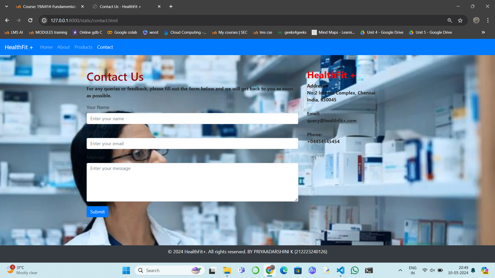

# Project Responsive Web Design using Bootstrap
## Date:09-05-24

## AIM:
To design a responsive website for a Pharmaceutical Company using Bootstrap.


## DESIGN STEPS:

### Step 1:
Clone the repository from GitHub.

### Step 2:
Create Django Admin project.

### Step 3:
Create a New App under the Django Admin project.

### Step 4:
Insert the necessary CSS and JavaScript files as external in order to use Bootstrap.

### Step 5:
Create a HTML file and include the needed Bootstrap components.

### Step 6:
Publish the website in the LocalHost.

## PROGRAM :
```
resweb.html
<!DOCTYPE html>
<html lang="en">
<head>
  <meta charset="UTF-8">
  <meta name="viewport" content="width=device-width, initial-scale=1.0">
  <title>Home - HealthFit+</title>
  <!-- Bootstrap CSS -->
  <link href="https://stackpath.bootstrapcdn.com/bootstrap/4.5.2/css/bootstrap.min.css" rel="stylesheet">
  <style>
    body {
      background-image: url("bgmed1.png");
      background-size: cover;
      background-repeat: no-repeat;
    }
    .navbar {
      background-color: orange; 
    }
    h2{
      color: red;
    }
    footer {
      position: fixed;
      bottom: 0;
      width: 100%;
      background-color: rgb(47, 47, 62);
      color: white;
      padding: 10px 0;
    }
  </style>
</head>
<body>
  <nav class="navbar navbar-expand-lg navbar-dark bg-primary">
    <a class="navbar-brand" href="#">HealthFit+</a>
    <button class="navbar-toggler" type="button" data-toggle="collapse" data-target="#navbarSupportedContent" aria-controls="navbarSupportedContent" aria-expanded="false" aria-label="Toggle navigation">
      <span class="navbar-toggler-icon"></span>
    </button>

    <div class="collapse navbar-collapse" id="navbarSupportedContent">
      <ul class="navbar-nav mr-auto">
        <li class="nav-item active">
          <a class="nav-link" href="resweb.html">Home <span class="sr-only">(current)</span></a>
        </li>
        <li class="nav-item">
          <a class="nav-link" href="aboutus.html">About</a>
        </li>
        <li class="nav-item">
          <a class="nav-link" href="product.html">Products</a>
        </li>
        <li class="nav-item">
          <a class="nav-link" href="contact.html">Contact</a>
        </li>
      </ul>
      <ul class="navbar-nav ml-auto">
        <li class="nav-item">
          <a class="nav-link" href="#">Login</a>
        </li>
        <li class="nav-item">
          <a class="nav-link" href="#">Register</a>
        </li>
      </ul>
    </div>
  </nav>
  <div class="container mt-5">
    <div class="row">
      <div class="col-md-8">
        <h2>HEALTHCHECK +</h1>
        <p><b>Welcome to HealthFit+, your trusted source for high-quality pharmaceutical products. We are dedicated to improving the health and well-being of our customers by providing safe and effective medications.</b></p>
        <p><b>At HealthFit+, we offer a wide range of prescription and over-the-counter medications to meet your healthcare needs. Whether you're managing a chronic condition or simply looking for relief from minor ailments, we have the products you need.</b></p>
        <p><b>In addition to medications, we also carry a variety of healthcare products and accessories, including vitamins, supplements, first aid supplies, and more. Our knowledgeable staff is here to assist you with any questions you may have and to ensure you find the right products for your needs.</b></p>
        <p><b>Thank you for choosing HealthFit+ for your healthcare needs. We look forward to serving you and helping you live a healthier life.</b></p>
      </div>
      <div class="col-md-4">
        
      </div>
    </div>
  </div>
  <footer class="bg-dark text-white text-center">
    <div class="container">
      <p>&copy; 2024 HealthFit+. All rights reserved. BY PRIYAADARSHINI K (212223240126)</p>
    </div>
  </footer>
  <script src="https://code.jquery.com/jquery-3.5.1.slim.min.js"></script>
  <script src="https://cdn.jsdelivr.net/npm/popper.js@1.16.1/dist/umd/popper.min.js"></script>
  <script src="https://stackpath.bootstrapcdn.com/bootstrap/4.5.2/js/bootstrap.min.js"></script>
</body>
</html>
```
```
aboutus.html
<!DOCTYPE html>
<html lang="en">
<head>
  <meta charset="UTF-8">
  <meta name="viewport" content="width=device-width, initial-scale=1.0">
  <title> HealthFit +</title>
  <link href="https://stackpath.bootstrapcdn.com/bootstrap/4.5.2/css/bootstrap.min.css" rel="stylesheet">
  <style>
    body {
      background-image: url("bgmed1.png");
      background-size: cover;
      background-repeat: no-repeat;
    }
    footer {
      position: fixed;
      bottom: 0;
      width: 100%;
      background-color: rgb(47, 47, 62);
      color: white;
      padding: 10px 0;
    }
  </style>
</head>
<body>
  <nav class="navbar navbar-expand-lg navbar-dark bg-primary">
    <a class="navbar-brand" href="#">HealthFit +</a>
    <button class="navbar-toggler" type="button" data-toggle="collapse" data-target="#navbarSupportedContent" aria-controls="navbarSupportedContent" aria-expanded="false" aria-label="Toggle navigation">
      <span class="navbar-toggler-icon"></span>
    </button>

    <div class="collapse navbar-collapse" id="navbarSupportedContent">
      <ul class="navbar-nav mr-auto">
        <li class="nav-item">
          <a class="nav-link" href="resweb.html">Home</a>
        </li>
        <li class="nav-item dropdown active">
          <a class="nav-link dropdown-toggle" href="aboutus.html" id="navbarDropdownAbout" role="button" data-toggle="dropdown" aria-haspopup="true" aria-expanded="false">
            About
          </a>
          <div class="dropdown-menu" aria-labelledby="navbarDropdownAbout">
            <a class="dropdown-item" href="#vision">History</a>
            <a class="dropdown-item" href="#mission">Leadership Team</a>
            <a class="dropdown-item" href="#values">CSR</a>
          </div>
        </li>
        <li class="nav-item">
          <a class="nav-link" href="products.html">Products</a>
        </li>
        <li class="nav-item">
          <a class="nav-link" href="contact.html">Contact Us</a>
        </li>
      </ul>
    </div>
  </nav>
  <b>
  <div class="container mt-5">
    <div class="row">
      <div class="col-md-12">
        <h1>About  HealthFit+</h1>
      <i>  <div id="HISTORY"> </i>
          <h2>History</h2>
          <p>Founded in 2015, HealthFit+ has been a leader in healthcare for over two decades, consistently focusing on quality and innovation.</p>
        </div>
        <div id="LEADERSHIP TEAM">
          <h2>Leadership Team</h2>
          <p>Our leadership team consists of industry experts with a wealth of experience in healthcare and pharmaceutical industries.</p>
        </div>
        <div id="CSR">
          <h2>Corporate Social Responsibility</h2>
          <ul>
            <li> HealthFit+ is committed to giving back to the community through various initiatives, including health awareness programs and sustainability projects.</li>
            <li>Quality: We are committed to maintaining the highest standards of quality in everything we do.</li>
            <li>Integrity: We conduct our business with honesty, transparency, and ethical behavior.</li>
            <li>Innovation: We strive to continuously innovate and improve our products and services to better serve our customers.</li>
            <li>Customer Focus: We are dedicated to understanding and meeting the needs of our customers.</li>
            <li>Teamwork: We work together as a team to achieve our goals and deliver exceptional results.</li>
          </ul>
        </div>
      </div>
    </div>
  </div>
 <footer class="bg-dark text-white text-center">
    <div class="container">
      <p>&copy; 2024 HealthFit+. All rights reserved. BY PRIYAADARSHINI K (212223240126)</p>
    </div>
  </footer>
</b>
  <script src="https://code.jquery.com/jquery-3.5.1.slim.min.js"></script>
  <script src="https://cdn.jsdelivr.net/npm/popper.js@1.16.1/dist/umd/popper.min.js"></script>
  <script src="https://stackpath.bootstrapcdn.com/bootstrap/4.5.2/js/bootstrap.min.js"></script>
</body>
</html>
```
```
products.html
<!DOCTYPE html>
<html lang="en">
<head>
  <meta charset="UTF-8">
  <meta name="viewport" content="width=device-width, initial-scale=1.0">
  <title>HealthFit +</title>
  <link href="https://stackpath.bootstrapcdn.com/bootstrap/4.5.2/css/bootstrap.min.css" rel="stylesheet">
  <style>
    body {
      background-image: url("bgmed2.png");
      background-size: cover;
      background-repeat: no-repeat;
    }
    footer{
      position: fixed;
      left: 0;
      bottom: 0;
      width: 100%;
      background-color: #14181c; 
      color: white;
      text-align: center;
      padding: 2px 0; 
    }
  </style>
</head>
<body>

  
  <nav class="navbar navbar-expand-lg navbar-dark bg-primary">

    <a class="navbar-brand" href="#">HealthFit +</a>
    <button class="navbar-toggler" type="button" data-toggle="collapse" data-target="#navbarSupportedContent" aria-controls="navbarSupportedContent" aria-expanded="false" aria-label="Toggle navigation">
      <span class="navbar-toggler-icon"></span>
    </button>

    <div class="collapse navbar-collapse" id="navbarSupportedContent">
      <ul class="navbar-nav mr-auto">
        <li class="nav-item">
          <a class="nav-link" href="resweb.html">Home</a>
        </li>
        <li class="nav-item">
          <a class="nav-link" href="products.html">About</a>
        </li>
        <li class="nav-item active">
          <a class="nav-link" href="aboutus.html">Products <span class="sr-only">(current)</span></a>
        </li>
        <li class="nav-item">
          <a class="nav-link" href="contact.html">Contact</a>
        </li>
      </ul>
      <ul class="navbar-nav ml-auto">
        <li class="nav-item">
          <a class="nav-link" href="#">Login</a>
        </li>
        <li class="nav-item">
          <a class="nav-link" href="#">Register</a>
        </li>
      </ul>
    </div>
  </nav>
  <div class="container mt-5">
    <div class="row">
      <div class="col-md-12">
        <h1>Our Products</h1>
        <div class="card-deck">
          <div class="card">
            
            <div class="card-body">
              <h5 class="card-title">Multivitamin Tablets</h5>
              <p class="card-text">Multivitamin product used to treat or prevent vitamin deficiency due to poor diet, certain illnesses, or during pregnancy.- 50tablets.</p>
              <a href="#" class="btn btn-primary">Buy Now</a>
            </div>
          </div>
          <div class="card">
            
            <div class="card-body">
              <h5 class="card-title">Benadryl-cough formula</h5>
              <p class="card-text">Benadryl Cough Formula Syrup, 50 ml belongs to a class of medications called 'expectorants' used to treat cough.-150ml</p>
              <a href="#" class="btn btn-primary">Buy Now</a>
            </div>
          </div>
          <div class="card">
            
            <div class="card-body">
              <h5 class="card-title">Cetaphil-Healing Ointment</h5>
              <p class="card-text">This soothing ointment is specially formulated with a high concentration of skin protectant Petrolatum to protect baby's dry, chapped, or irritated skin.-340g</p>
              <a href="#" class="btn btn-primary">Buy Now</a>
            </div>
          </div>
          <div class="card">
            
            <div class="card-body">
              <h5 class="card-title">First-aid Kit</h5>
              <p class="card-text">First-aid kits help you handle the medical emergencies as quickly as possible.- 1box</p>
              <a href="#" class="btn btn-primary">Buy Now</a>
          </div>
        </div>
        <div class="card">
          
          <div class="card-body">
            <h5 class="card-title">Cipladine</h5>
            <p class="card-text">Cipladine Ointment is an anti-septic ointment which is used as a first aid to prevent infection in minor wounds, cuts, scrapes, burns and abrasions. - 1box</p>
            <a href="#" class="btn btn-primary">Buy Now</a>
        </div>
      </div>
    </div>
  </div>
</div>
  <footer class="bg-dark text-white text-center">
    <div class="container">
      <p>&copy; 2024 HealthFit+. All rights reserved. BY PRIYAADARSHINI K (212223240126)</p>
    </div>
  </footer>

  <!-- Bootstrap JS -->
  <script src="https://code.jquery.com/jquery-3.5.1.slim.min.js"></script>
  <script src="https://cdn.jsdelivr.net/npm/popper.js@1.16.1/dist/umd/popper.min.js"></script>
  <script src="https://stackpath.bootstrapcdn.com/bootstrap/4.5.2/js/bootstrap.min.js"></script>
</body>
</html>
```
```
contact.html
<!DOCTYPE html>
<html lang="en">
<head>
  <meta charset="UTF-8">
  <meta name="viewport" content="width=device-width, initial-scale=1.0">
  <title>Contact Us - HealthFit +</title>
  <!-- Bootstrap CSS -->
  <link href="https://stackpath.bootstrapcdn.com/bootstrap/4.5.2/css/bootstrap.min.css" rel="stylesheet">
  <!-- Custom CSS -->
  <style>
    body {
      background-image: url("bgmed2.png");
      background-size: cover;
      background-repeat: no-repeat;
    }
    h1{
      color: rgb(142, 10, 23);
    }
    h2{
      color: red;
    }
    footer{
      position: fixed;
      left: 0;
      bottom: 0;
      width: 100%;
      background-color: #000101; 
      color: white;
      text-align: center;
      padding: 10px 0; 
    }
  </style>
</head>
<body>

  <!-- Navbar -->
  <nav class="navbar navbar-expand-lg navbar-dark bg-primary">
    <a class="navbar-brand" href="#">HealthFit +</a>
    <button class="navbar-toggler" type="button" data-toggle="collapse" data-target="#navbarSupportedContent" aria-controls="navbarSupportedContent" aria-expanded="false" aria-label="Toggle navigation">
      <span class="navbar-toggler-icon"></span>
    </button>

    <div class="collapse navbar-collapse" id="navbarSupportedContent">
      <ul class="navbar-nav mr-auto">
        <li class="nav-item">
          <a class="nav-link" href="resweb.html">Home</a>
        </li>
        <li class="nav-item">
          <a class="nav-link" href="aboutus.html">About</a>
        </li>
        <li class="nav-item">
          <a class="nav-link" href="products.html">Products</a>
        </li>
        <li class="nav-item active">
          <a class="nav-link" href="contact.html">Contact <span class="sr-only">(current)</span></a>
        </li>
      </ul>
    </div>
  </nav>

  <!-- Page Content -->
  <div class="container mt-5">
    <div class="row">
      <div class="col-md-8">
        <h1>Contact Us</h1>
        <p><b>For any queries or feedback, please fill out the form below and we will get back to you as soon as possible.</b></p>
        <form>
          <div class="form-group">
            <label for="name">Your Name</label>
            <input type="text" class="form-control" id="name" placeholder="Enter your name">
          </div>
          <div class="form-group">
            <label for="email">Your Email</label>
            <input type="email" class="form-control" id="email" placeholder="Enter your email">
          </div>
          <div class="form-group">
            <label for="message">Message</label>
            <textarea class="form-control" id="message" rows="5" placeholder="Enter your message"></textarea>
          </div>
          <button type="submit" class="btn btn-primary">Submit</button>
        </form>
      </div>
      <div class="col-md-4">
        <h2><b>HealthFit +</b></h2>
        <address>
          <strong>Address:</strong><br>
          <b>No:2 Intense Complex, Chennai</b><br>
          <b>India, 630045</b><br><br>
          <strong>Email:</strong><br>
          <b>query@healthfit+.com</b><br><br>
          <strong>Phone:</strong><br>
          <b>+04454545454</b>
        </address>
      </div>
    </div>
  </div>

  <!-- Footer -->
  <footer class="bg-dark text-white text-center">
    <div class="container">
      <p>&copy; 2024 HealthFit+. All rights reserved. BY PRIYAADARSHINI K (212223240126)</p>
    </div>
  </footer>

  <!-- Bootstrap JS -->
  <script src="https://code.jquery.com/jquery-3.5.1.slim.min.js"></script>
  <script src="https://cdn.jsdelivr.net/npm/popper.js@1.16.1/dist/umd/popper.min.js"></script>
  <script src="https://stackpath.bootstrapcdn.com/bootstrap/4.5.2/js/bootstrap.min.js"></script>
</body>
</html>
```
## OUTPUT:




## RESULT:
The Project for responsive web design using Bootstrap is completed successfully.
